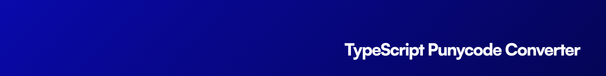

<p align="center"></p>

[![npm version][npm-version-src]][npm-version-href]
[![GitHub Actions][github-actions-src]][github-actions-href]
[](http://commitizen.github.io/cz-cli/)
<!-- [![npm downloads][npm-downloads-src]][npm-downloads-href] -->
<!-- [![Codecov][codecov-src]][codecov-href] -->

# ts-punycode

A modern TypeScript implementation of Punycode (RFC 3492) with full RFC 5891 support. This library helps you convert Unicode domain names to ASCII (Punycode) and back.

## Features

- 🔄 **Bidirectional Conversion** - Convert between Unicode and Punycode seamlessly
- 📧 **Email Support** - Handles email addresses with Unicode domains
- 💪 **Type-Safe** - Full TypeScript support with comprehensive type definitions
- 🌐 **RFC Compliant** - Implements RFC 3492 and RFC 5891 specifications
- 🧪 **Well-Tested** - Comprehensive test suite ensuring reliability
- 📦 **Zero Dependencies** - Lightweight and self-contained
- 🔍 **Unicode 15.1** - Support for the latest Unicode standard

## Installation

```bash
# Using npm
npm install ts-punycode

# Using yarn
yarn add ts-punycode

# Using pnpm
pnpm add ts-punycode

# Using bun
bun add ts-punycode
```

## Usage

### Basic Usage

```typescript
import punycode from 'ts-punycode'

// Convert Unicode to Punycode
punycode.encode('münchen') // Returns 'mnchen-3ya'

// Convert Punycode to Unicode
punycode.decode('mnchen-3ya') // Returns 'münchen'

// Convert Domain Names
punycode.toASCII('münchen.de') // Returns 'xn--mnchen-3ya.de'
punycode.toUnicode('xn--mnchen-3ya.de') // Returns 'münchen.de'

// Handle Email Addresses
punycode.toASCII('user@münchen.de') // Returns 'user@xn--mnchen-3ya.de'
punycode.toUnicode('user@xn--mnchen-3ya.de') // Returns 'user@münchen.de'
```

### Advanced Usage

```typescript
import punycode from 'ts-punycode'
// import { punycode } from 'ts-punycode'

// Working with Unicode Code Points
const codePoints = punycode.ucs2.decode('☃') // Returns [9731]
const string = punycode.ucs2.encode([9731]) // Returns '☃'

// Version Information
console.log(punycode.version) // Returns current version
```

## API Reference

### Main Methods

- **`encode(input: string): string`**
  Converts a string of Unicode symbols to a Punycode string of ASCII-only symbols.

- **`decode(input: string): string`**
  Converts a Punycode string of ASCII-only symbols to a string of Unicode symbols.

- **`toASCII(input: string): string`**
  Converts a Unicode string representing a domain name or email address to Punycode.

- **`toUnicode(input: string): string`**
  Converts a Punycode string representing a domain name or email address to Unicode.

### UCS-2 Utilities

- **`ucs2.decode(string: string): number[]`**
  Creates an array containing the numeric code points of each Unicode character.

- **`ucs2.encode(codePoints: number[]): string`**
  Creates a string based on an array of numeric code points.

## Error Handling

The library throws `RangeError` with descriptive messages for various error conditions:

- **Overflow**: When input needs wider integers to process
- **Not Basic**: When encountering illegal input >= 0x80 (not a basic code point)
- **Invalid Input**: For general invalid input conditions

## Contributing

Please see [CONTRIBUTING](.github/CONTRIBUTING.md) for details.

## Community

For help, discussion about best practices, or any other conversation that would benefit from being searchable:

[Discussions on GitHub](https://github.com/stacksjs/ts-punycode/discussions)

For casual chit-chat with others using this package:

[Join the Stacks Discord Server](https://discord.gg/stacksjs)

## Postcardware

Stacks OSS will always stay open-sourced, and we will always love to receive postcards from wherever Stacks is used! _And we also publish them on our website. Thank you, Spatie._

Our address: Stacks.js, 12665 Village Ln #2306, Playa Vista, CA 90094, United States 🌎

## Credits

- [Mathias Bynens](https://github.com/mathiasbynens)
- [Punycode.js](https://github.com/bestiejs/punycode.js)
- [Chris Breuer](https://github.com/chrisbreuer)

## Sponsors

We would like to extend our thanks to the following sponsors for funding Stacks development. If you are interested in becoming a sponsor, please reach out to us.

- [JetBrains](https://www.jetbrains.com/)
- [The Solana Foundation](https://solana.com/)

## License

The MIT License (MIT). Please see [LICENSE](LICENSE.md) for more information.

Made with 💙

<!-- Badges -->
[npm-version-src]: https://img.shields.io/npm/v/ts-punycode?style=flat-square
[npm-version-href]: https://npmjs.com/package/ts-punycode
[github-actions-src]: https://img.shields.io/github/actions/workflow/status/stacksjs/ts-punycode/ci.yml?style=flat-square&branch=main
[github-actions-href]: https://github.com/stacksjs/ts-punycode/actions?query=workflow%3Aci

<!-- [codecov-src]: https://img.shields.io/codecov/c/gh/stacksjs/ts-starter/main?style=flat-square
[codecov-href]: https://codecov.io/gh/stacksjs/ts-starter -->
